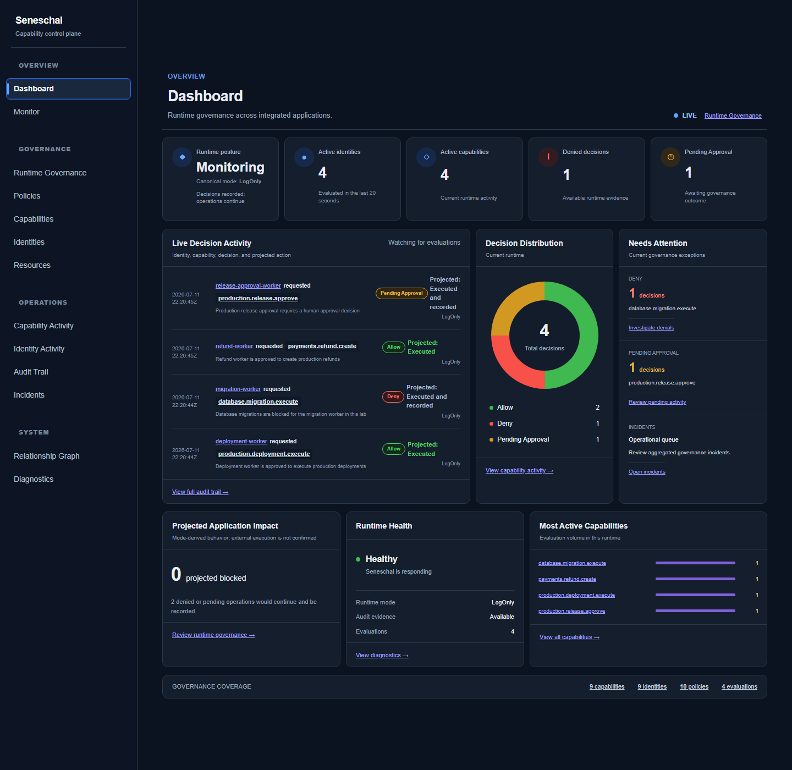

# Seneschal

Seneschal is an AI capability governance platform for evaluating runtime capability requests before an application executes a privileged operation. Applications submit the requesting identity, capability, environment, and resource; Seneschal evaluates configured policy and returns an `Allow`, `Deny`, or `PendingApproval` decision.

The project is under active development. Its current runtime, SDKs, portal, and demonstration applications are suitable for local evaluation; the production controls listed under [Planned](#planned) are not yet implemented.



## Current capabilities

- **Runtime policy evaluation** — evaluates identity, capability, environment, and resource context against configured policies.
- **Decision outcomes** — returns `Allow`, `Deny`, or `PendingApproval`, including the matched policy and decision reason.
- **Runtime modes** — `LogOnly` records deny and pending-approval outcomes while integrated operations continue; `Enforce` projects those outcomes as blocked. The mode is currently held in memory and resets to `LogOnly` when the runtime restarts.
- **Package-based .NET client** — `Seneschal.Client` provides the public API used by applications to request decisions.
- **ASP.NET Core integration** — `Seneschal.AspNetCore` provides service registration, middleware, attribute-based protection, and fluent endpoint protection.
- **Runtime evidence** — successful evaluations produce audit, activity, metrics, and export records. Runtime and audit data are currently in memory and reset on restart.
- **Live governance portal** — Razor-based operational views use current runtime data and lightweight polling without a client-side framework.

The current portal exposes:

- Dashboard
- Runtime Governance
- Policies
- Capabilities
- Identities
- Resources
- Capability Activity
- Identity Activity
- Audit Trail
- Incidents
- Relationship Graph
- Diagnostics

`PendingApproval` is a decision state today; a workflow for reviewing and resolving approvals is not implemented.

## Demonstration workers

The [multi-application adoption lab](labs/multi-application-adoption/README.md) contains four independent console applications. Each uses the packaged `Seneschal.Client`, a scoped integration API key, and calls Seneschal before its simulated operation.

| Worker | Capability | Configured decision |
|---|---|---|
| Deployment Worker | `production.deployment.execute` | Allow |
| Refund Worker | `payments.refund.create` | Allow |
| Database Migration Worker | `database.migration.execute` | Deny |
| Release Approval Worker | `production.release.approve` | Pending Approval |

Together, the workers show the difference between observation and enforcement:

- In `LogOnly`, allow, deny, and pending-approval outcomes are recorded while all simulated operations continue.
- In `Enforce`, allowed operations continue; denied operations are blocked; pending-approval operations are blocked pending approval.

See the lab README for package preparation, configuration, and exact PowerShell commands.

## Architecture

Seneschal sits on the execution path of an integrated operation. The application remains responsible for honoring the returned effective action.

```text
Application
    │ capability request
    ▼
Seneschal Runtime
    │
    ▼
Policy Evaluation
    │
    ├──► Decision ──► Application
    │
    └──► Audit / Activity / Metrics ──► Governance Portal
```

The runtime loads capabilities, identities, policies, and integration keys from configuration. The current implementation uses in-memory operational stores rather than durable persistence.

For the recommended application topology and request flow, see the [golden-path architecture](docs/architecture/golden-path.md).

## Current status

Seneschal is an alpha-stage project. The implementation is useful for local development, package integration testing, policy evaluation, and runtime-governance demonstrations, but it should not be treated as production-ready.

### Implemented

- Policy evaluation with allow, deny, pending-approval, and default-deny outcomes
- `LogOnly` and `Enforce` runtime behavior
- Scoped integration API-key authentication
- `Seneschal.Client` and `Seneschal.AspNetCore` prerelease packages
- Attribute-based, fluent-endpoint, and direct-client integration paths
- Audit events, capability and identity activity, decision metrics, and export events
- Live portal views, runtime diagnostics, health, readiness, and monitoring endpoints
- Configuration-driven capability, identity, resource, policy, and integration-key inventories
- Unit, integration, package smoke-test, and multi-application demonstration assets

### Planned

- Durable persistent storage and retention controls
- Administrative authorization and administrative audit events
- Production-grade authentication and integration-key management
- Multi-node runtime operation and high-availability behavior
- OpenTelemetry integration
- Kubernetes deployment support

These items describe roadmap direction documented in the repository; they are not available in the current runtime.

## Technology

- .NET 8 and .NET 9
- C#
- ASP.NET Core
- Razor Pages
- xUnit
- JavaScript
- HTML and CSS

## Build and test

From the repository root:

```powershell
dotnet build
dotnet test
```

For a package-based ASP.NET Core setup, use the [ASP.NET Core quickstart](docs/quickstart/aspnet-core-quickstart.md). For current validation scope and known operational gaps, see the [validation strategy](docs/qa/validation-strategy.md).

## Documentation

- [Customer onboarding](docs/product/customer-onboarding.md)
- [ASP.NET Core quickstart](docs/quickstart/aspnet-core-quickstart.md)
- [Golden-path architecture](docs/architecture/golden-path.md)
- [Validation strategy](docs/qa/validation-strategy.md)
- [Architecture decision records](docs/adr)
- [Project vision](docs/vision.md)
