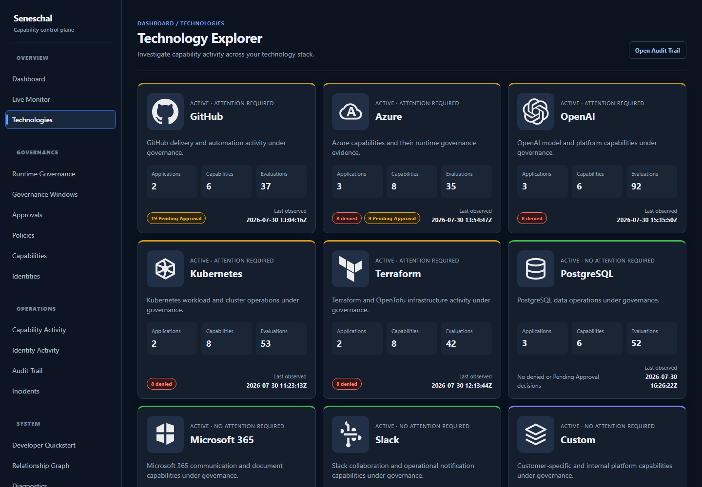

# Seneschal

Seneschal is a capability governance platform for understanding and controlling
how privileged operations are used across applications, automation, and AI
systems.

**Observe. Understand. Govern. Enforce.**

> Seneschal is under active development and is intended for local evaluation
> and demonstrations. Operational state and audit evidence are currently held
> in memory; this repository is not production-ready.

## Why capability governance?

Traditional authorization answers:

> Can this identity perform this action?

Seneschal adds the operational context needed to govern the action itself:

- What capabilities exist?
- Who is using them?
- What technologies expose them?
- Why was a decision made?
- What changed?
- What happened?

Integrated workloads submit identity, capability, environment, and resource
context before a governed operation. Seneschal evaluates policy and returns an
explainable `Allow`, `Deny`, or `PendingApproval` decision. The calling workload
remains responsible for honoring that result.

## Investigation workflow

```text
Dashboard
    ↓
Technology Explorer
    ↓
Capability Activity
    ↓
Decision Trace
    ↓
Audit Trail
```

Start on the **Dashboard** to understand current posture and locate activity
that needs attention. Use **Technology Explorer** to see which platforms expose
governed capabilities and where activity is concentrated. Pivot to
**Capability Activity** to understand who used a specific operation and how its
outcomes changed over time. Open a **Decision Trace** to see the policy,
runtime mode, reason, and effective action behind one decision. Finish in the
**Audit Trail** to filter and correlate the retained operational evidence.



## What you can do

### Observe

- **Live Monitor** — follow recent capability decisions as they occur.
- **Technology Posture** — compare governed platforms, activity, and attention
  signals.
- **Runtime Metrics** — inspect decision volumes and runtime outcomes.

### Investigate

- **Technology Explorer** — move from a platform to its applications,
  capabilities, policies, and recent evidence.
- **Capability Explorer** — browse the configured capability inventory,
  ownership, risk, and runtime activity.
- **Identity Activity** — understand the capabilities used by a workload or
  other identity.
- **Decision Trace** — explain one result using its request context, matched
  policy, reason, runtime mode, and effective action.
- **Incident Investigation** — examine grouped governance signals and pivot
  back to their source evidence.

### Govern

- **Policy Management** — inspect and configure capability policies.
- **Runtime Governance** — switch between `LogOnly` observation and `Enforce`
  behavior for the local runtime.
- **Approvals** — review operation-scoped, single-use approval requests.

### Audit

- **Audit Trail** — filter retained decisions and open individual traces.
- **Operational Evidence** — correlate identity, capability, environment,
  resource, policy, and outcome.
- **Historical Decisions** — investigate the bounded decision history retained
  by the running process.

## Architecture

```text
Applications / automation / AI
              │ capability request
              ▼
        Decision Engine ◄──── SDK
              │
              ├── Policy Engine
              ├── Capability Catalog
              └── Governance controls
              │
              ├──► decision ──► calling workload
              └──► Audit Store ──► Governance Graph ──► Portal
```

| Component | Responsibility |
|---|---|
| **Portal** | Operator experience for observation, investigation, governance, and audit. |
| **Decision Engine** | Resolves request context, policy results, runtime mode, approvals, and effective action. |
| **Policy Engine** | Evaluates configured policy against identities, capabilities, environments, and resources. |
| **Capability Catalog** | Describes governed operations, ownership, risk, and technology classification. |
| **Governance Graph** | Projects relationships among capabilities, identities, policies, resources, and technologies for investigation. |
| **Audit Store** | Retains bounded, process-local decision evidence for traces, activity views, metrics, and incidents. |
| **SDK** | Integrates .NET workloads with Seneschal's decision endpoint and ASP.NET Core enforcement points. |

The [golden-path architecture](docs/architecture/golden-path.md) describes the
recommended integration topology. The [runtime architecture](docs/runtime-architecture.md)
explains the decision path in more detail.

## Northwind Financial demo

Northwind Financial is a fictional cloud-native payments company used to
demonstrate Seneschal with coherent governance data. The opt-in profile provides
a deterministic 14-day baseline of 400 decisions, stable record identifiers,
and seeded activity across realistic identities, technologies, and
capabilities. The current baseline includes policy outcomes and limited
approval-required evidence; approval lifecycles, governance windows, and
incidents are produced separately by the live demo flows and are not seeded by
the history profile.

The configured catalog includes Azure, GitHub, Terraform/OpenTofu, Kubernetes,
OpenAI, PostgreSQL, Slack, Microsoft 365, and custom capabilities. Seeded
workloads exhibit healthy business-hour automation, sparse weekend activity,
and limited deny and approval-required outcomes.

### Start the deterministic environment

Prerequisites: PowerShell, a compatible .NET SDK, and NuGet.org access for the
initial package restore.

```powershell
git clone https://github.com/stevenhart235-dev/seneschal-core.git
cd seneschal-core

$env:Seneschal__Demo__NorthwindHistory__Enabled = 'true'
dotnet run --project Seneschal.Api
```

Open `http://localhost:5077/dashboard`. Stop the process with `Ctrl+C`, then
remove the opt-in setting:

```powershell
Remove-Item Env:Seneschal__Demo__NorthwindHistory__Enabled -ErrorAction SilentlyContinue
```

Restarting the API resets the process-local stores and rebuilds the same
relative history from a new startup-time anchor. See
[Northwind deterministic history](docs/demos/northwind-history.md) for seed
behavior, configuration, and limitations.

### Run the live demonstration

The standard launcher starts Seneschal and four package-based workers, waits
for readiness, and opens the Dashboard:

```powershell
.\demo.ps1
```

Optional presenter flows:

```powershell
.\demo-approval.ps1  # operation-scoped approval walkthrough
.\demo-run.ps1       # guided Production Freeze story
.\stop-demo.ps1      # stop only launcher-created processes
```

Process output is written under `artifacts/demo/logs/`. The
[Production Freeze guide](docs/demos/production-freeze.md) contains presenter
notes and expected outcomes.

## Product status

### Implemented today

- Explainable `Allow`, `Deny`, and `PendingApproval` capability decisions.
- `LogOnly` and `Enforce` runtime modes.
- Dashboard, Live Monitor, Technology Explorer, Technology Detail, Capability
  Explorer, Capability Activity, Identity Activity, Decision Trace, Incident
  Investigation, Approvals, Audit Trail, runtime metrics, and diagnostics.
- YAML-backed capability, identity, policy, and scoped integration-key
  configuration.
- Process-local audit evidence, activity projections, approvals, governance
  state, metrics, and incidents.
- ASP.NET Core middleware, attributes, and fluent endpoint protection.
- .NET client SDK plus GitHub Actions and Terraform/OpenTofu gate examples.
- Deterministic Northwind baseline history and local live-demo launchers.

### Roadmap, not current functionality

- Durable operational storage, retention, and production catalog management.
- Production-grade governance graph persistence and discovery.
- Scheduled, time-zone-aware governance windows and scoped break-glass
  restoration.
- Durable, administratively managed approval workflows.
- Administrative access control and audit evidence for governance changes.
- First-class application inventory and automated technology discovery.

See the [roadmap](docs/roadmap.md) for product direction. Roadmap descriptions
are not commitments or implemented behavior.

## Integrations

| Integration | Current implementation |
|---|---|
| [.NET Client SDK](Seneschal.Client/README.md) | Package-based client for the decision endpoint. |
| [ASP.NET Core](Seneschal.AspNetCore/README.md) | Registration, middleware, attribute protection, and fluent endpoint protection. |
| [GitHub Actions](integrations/github-actions/README.md) | PowerShell governance gate and sample pre-deployment workflow. |
| [Terraform/OpenTofu](integrations/terraform/README.md) | PowerShell pre-apply gate and local-only `terraform_data` example. |

The GitHub Actions and Terraform/OpenTofu integrations are repository examples,
not Marketplace actions, providers, or custom backends.

## Repository guide

| Path | Contents |
|---|---|
| `Seneschal.Core/` | Domain models, policy evaluation, decisions, audit, activity, and governance services. |
| `Seneschal.Api/` | HTTP API, Razor Pages portal, configuration, and local runtime composition. |
| `Seneschal.Client/` | .NET client SDK. |
| `Seneschal.AspNetCore/` | ASP.NET Core integration package. |
| `Seneschal.Cli/` | Command-line client. |
| `Seneschal.Samples.*/` | Integration and capability-control samples. |
| `integrations/` | GitHub Actions and Terraform/OpenTofu examples. |
| `labs/` | Multi-application adoption demonstration. |
| `docs/` | Concepts, architecture, product guidance, ADRs, demos, and QA notes. |

## Build and test

```powershell
dotnet build
dotnet test
```

## Documentation

- [Getting started](docs/getting-started.md)
- [ASP.NET Core quickstart](docs/quickstart/aspnet-core-quickstart.md)
- [Customer onboarding](docs/product/customer-onboarding.md)
- [Operator investigation workflow](docs/product/operator-navigation-spine.md)
- [Architecture](docs/architecture.md)
- [Validation strategy](docs/qa/validation-strategy.md)
- [Architecture decision records](docs/adr)
- [Glossary](docs/glossary.md)

## License

The repository includes a `LICENSE` file, but licensing terms have not yet been
published. Resolve this before treating the repository as open source or
accepting external contributions.
